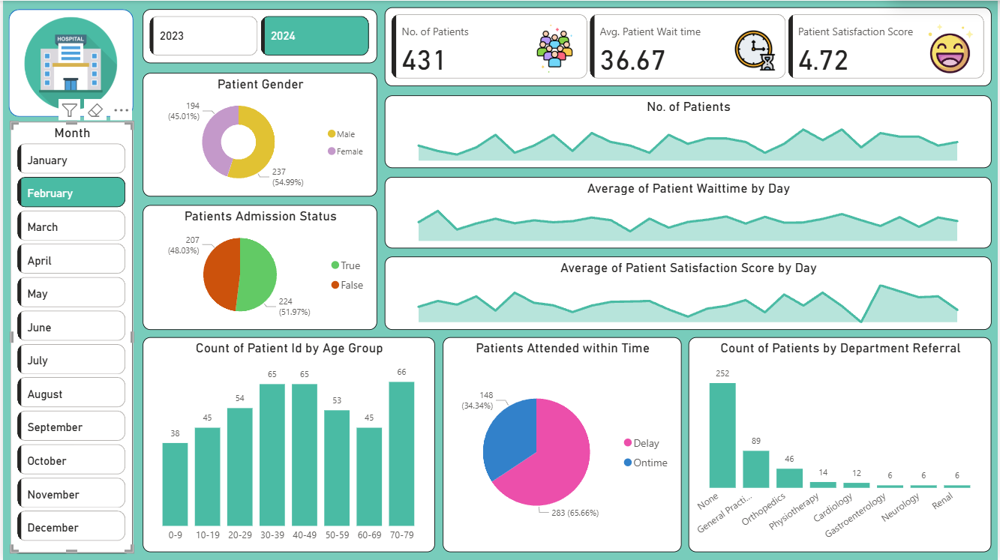

# Hospital-Dashboard-PowerBI
A Power BI Dashboard project analyzing Hospital Emergency Room data to provide actionable insights on patient inflow, waiting times, admission status, age distribution, satisfaction scores, and departmental referrals. Designed for hospital administrators to monitor performance and optimize emergency room operations through data visualization.

This Power BI dashboard provides a comprehensive visualization and analysis of patient data from a Hospital Emergency Room. It is designed to help hospital administrators and healthcare professionals monitor key performance metrics and patient flow over time.

## ✅ Key Insights and Features

- **Year and Month Filter:**  
  Interactive slicers allow selection of year (2023 or 2024) and month for dynamic reporting.
  
- **Patient Gender Distribution:**  
  Visual breakdown of male vs female patient visits.

- **Admission Status Overview:**  
  Displays the proportion of admitted vs non-admitted patients.

- **Patient Count Trends:**  
  - Daily patient visits and average waiting times are plotted for easy time-based comparison.  
  - Average patient satisfaction scores are tracked by day.

- **Age Group Analysis:**  
  Bar chart showing the number of patients categorized into age groups (e.g., 0-9, 10-19, …, 70-79).
  
- **Attendance Time Performance:**  
  Pie chart visualizing the percentage of patients attended On-time vs Delay, helping to assess service efficiency.

- **Department Referral Breakdown:**  
  Displays the count of patients referred to different departments (e.g., General Practice, Orthopedics, Cardiology, etc.).

## 🎯 Use Case

This dashboard empowers hospital management to:
- Quickly identify trends in patient inflow.
- Assess waiting time performance and patient satisfaction.
- Analyze patient demographics and referral patterns.
- Make data-driven decisions to improve operational efficiency.

## 🖼️ Dashboard Preview

